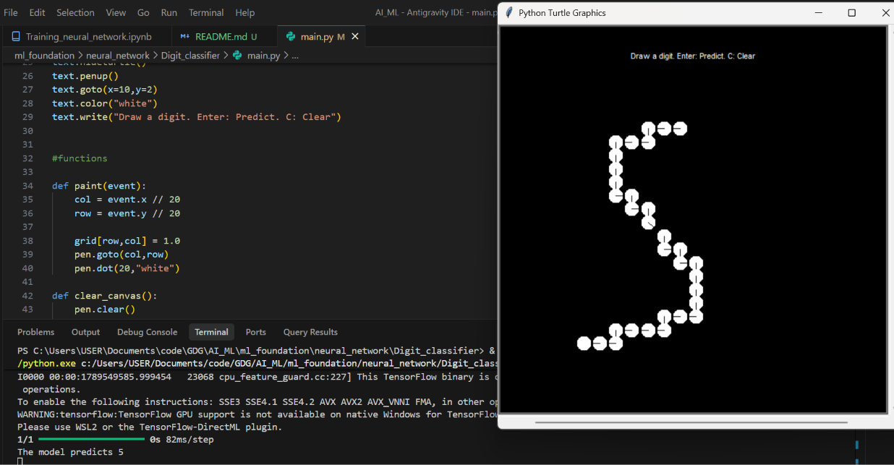

# Digit Classifier Drawing Interface 🎨🤖

An interactive graphical interface built with Python's `turtle` module that bridges the gap between human input and machine learning. This application allows users to draw digits freehand on a digital canvas and feeds those strokes directly into a pre-trained Keras/TensorFlow neural network for real-time predictions.

## 🚀 Demo


*The demo above showcases drawing a digit, triggering the prediction via the keyboard, and clearing the canvas to start over.*

---

## 🧠 Why I Built This: Demystifying Neural Networks
One of my biggest takeaways from building this project was finally understanding exactly how neural networks are applied in the real world. 

Before this, AI felt a bit like a black box—you train a model on a dataset, but how do you actually *use* it in a live app? Implementing this interface connected the dots for me:
* **Data Translation is Everything:** I learned that a neural network doesn't "see" an image; it only sees matrices. Figuring out how to map a user's mouse movements on a visual UI to a raw 28x28 NumPy array in the background was a huge "aha!" moment.
* **Understanding Input Shapes:** When my initial predictions failed, I realized that models trained on thousands of images expect data in batches. Reshaping my single 2D grid into a 3D tensor `(1, 28, 28)` taught me exactly how data must be packaged before being handed to an AI.
* **AI is Just a Function Call:** Stripping away the complexity, I realized that applying a neural network simply boils down to formatting user data correctly and passing it to a `.predict()` method. It made machine learning feel accessible and highly practical.

---

## 🛠️ Built With
* **Python:** The backbone of the application, handling the core logic and tying the frontend to the machine learning backend.
* **NumPy:** Used for matrix manipulation. The visual drawing is continuously translated into a 28x28 grid of values.
* **Turtle / Tkinter:** Handles the GUI, canvas rendering, and custom coordinate mapping. It also manages the event listeners for mouse actions (`<B1-Motion>`) and keyboard triggers (`<Return>`, `c`).
* **TensorFlow / Keras:** Loads the pre-trained `digit_classifier.keras` model, processes the input data, and calculates the probability array to determine the highest confidence digit.

---

## ⚙️ How It Works Under the Hood
1.  **Coordinate Mapping:** The Turtle screen uses custom world coordinates (`0, 28, 28, 0`) to perfectly align the 560x560 pixel window with a 28x28 NumPy array. This means a visual Y-coordinate directly matches an array row index.
2.  **Active Listening:** The canvas binds to `<B1-Motion>` to track the mouse drag, filling the background array with values while simultaneously drawing digital ink on the screen.
3.  **The Prediction Pipeline:** Pressing the `Enter` key freezes the canvas state. The application takes the 28x28 `grid`, reshapes it to add a batch dimension, and feeds it into the Keras model. The model outputs 10 probabilities, and `np.argmax()` extracts the winning digit.
4.  **Canvas Reset:** Pressing the `C` key clears the visual Tkinter ink and instantly zeroes out the NumPy array (`grid.fill(0)`), prepping the system for the next drawing.

---

## 💻 Running it Locally

To test this project on your own machine, follow these steps:

**1. Clone the repository**
```bash
git clone [https://github.com/yourusername/your-repo-name.git](https://github.com/yourusername/your-repo-name.git)
cd your-repo-name